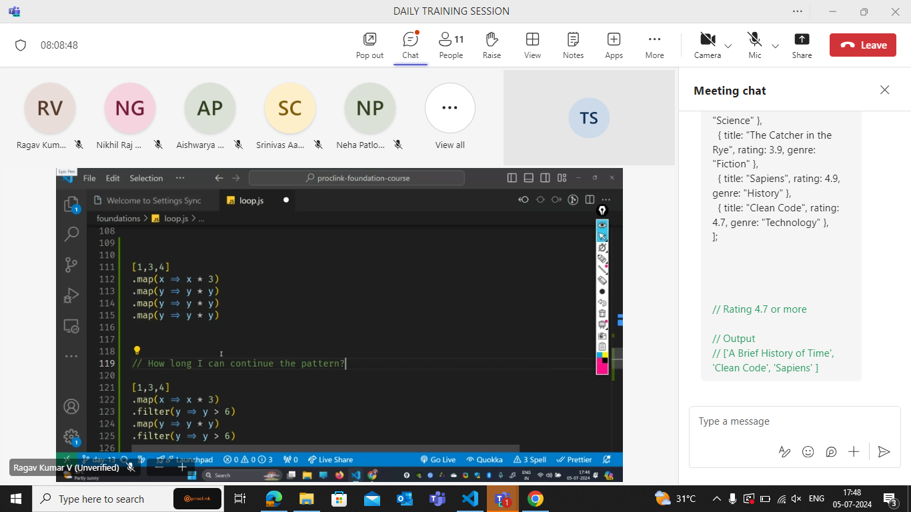
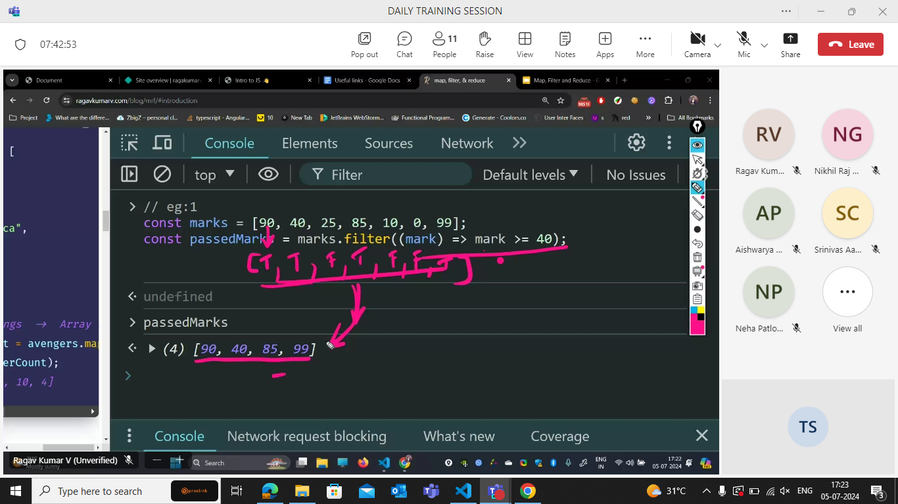
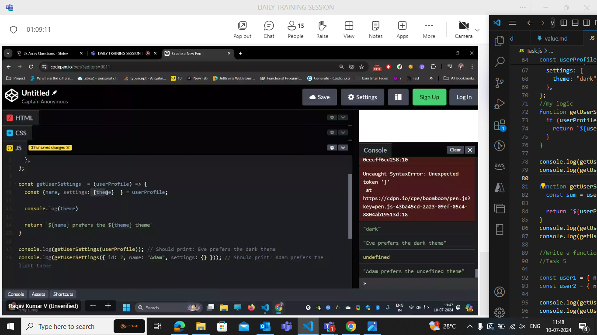
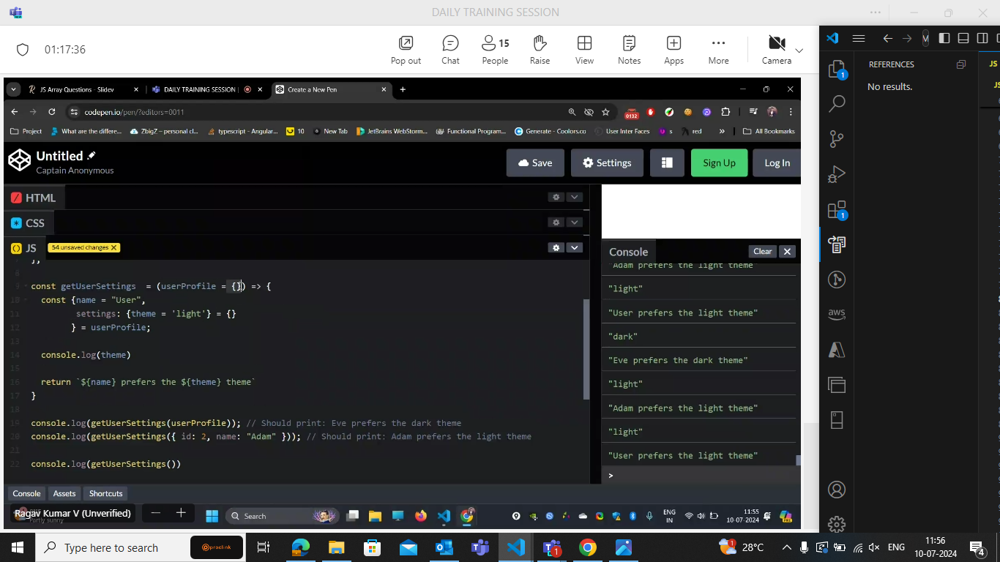
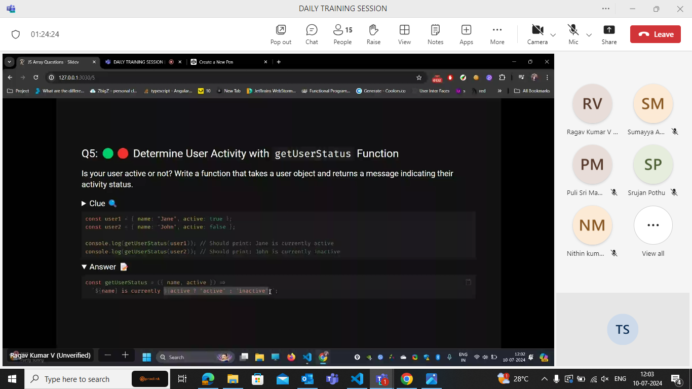
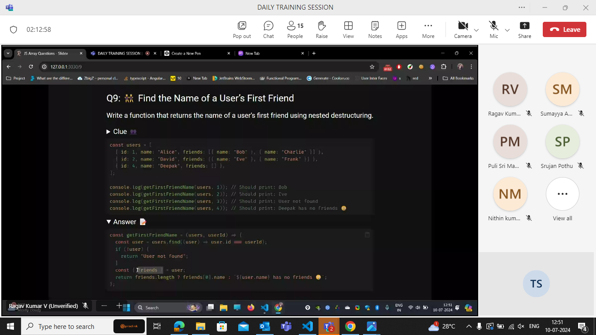

---
# You can also start simply with 'default'
theme: seriph
# random image from a curated Unsplash collection by Anthony
# like them? see https://unsplash.com/collections/94734566/slidev
background: https://cover.sli.dev
# some information about your slides (markdown enabled)
title: Array Methods
info: |
  ## Slidev Starter Template
  Presentation slides for developers.

  Learn more at [Sli.dev](https://sli.dev)
# apply unocss classes to the current slide
class: text-center
# https://sli.dev/custom/highlighters.html
highlighter: shiki
# https://sli.dev/guide/drawing
drawings:
  persist: false
# slide transition: https://sli.dev/guide/animations#slide-transitions
transition: slide-left
# enable MDC Syntax: https://sli.dev/guide/syntax#mdc-syntax
mdc: true
---

# Array Methods

Efficient way to manipulate and work with collections of data.

<div class="pt-12">
  <span @click="$slidev.nav.next" class="px-2 py-1 rounded cursor-pointer" hover="bg-white bg-opacity-10">
    Come Let's Learn More <carbon:arrow-right class="inline"/>
  </span>
</div>

<!--
The last comment block of each slide will be treated as slide notes. It will be visible and editable in Presenter Mode along with the slide. [Read more in the docs](https://sli.dev/guide/syntax.html#notes)
-->

---

## Developer

<v-clicks style="place-content : center">


Working with Immutable array methods.

<AutoFitText :max="30" :min="10" modelValue="Immutable Methods : Returns a new array with the results"/>

</v-clicks>

---

<v-clicks>

# Map

</v-clicks>



<v-clicks>

`Map` : This is used to iterate over an array and transform each element in the array based on a callback function.

</v-clicks>

---

<v-clicks>

Without `map()` method:

```js
const numbers = [1, 2, 3, 4, 5];
const doubledNumbers = [];

// Using a traditional for loop to double each number
for (let i = 0; i < numbers.length; i++) {
  doubledNumbers[i] = numbers[i] * 2;
}
console.log(doubledNumbers); // Output: [2, 4, 6, 8, 10]
```

Using `map()` method:

```js
// Array of numbers
const numbers = [1, 2, 3, 4, 5];
const doubledNumbers = numbers.map((num) => num * 2);
console.log(doubledNumbers); // Output: [2, 4, 6, 8, 10]
```

 </v-clicks>

---

 <v-clicks>

# Filter

</v-clicks>



<v-clicks>

`filter()` :Returns a new array containing elements that pass a test specified

</v-clicks>

---

<v-clicks>

Without `Filter()` method:

```js
const numbers = [1, 2, 3, 4, 5];
const evenNumbers = [];

// Traditional approach with a for loop
for (let i = 0; i < numbers.length; i++) {
  if (numbers[i] % 2 === 0) {
    evenNumbers.push(numbers[i]);
  }
}

console.log(evenNumbers); // Output: [2, 4]
```

Using `Filter()` method:

```js
// Array of numbers
const numbers = [1, 2, 3, 4, 5];
const evenNumbers = numbers.filter((num) => num % 2 === 0);
console.log(evenNumbers); // Output: [2, 4]
```

 </v-clicks>

---

<v-clicks>

# Reduce

</v-clicks>


---

<v-clicks>

Without `Reduce()` method:

```js
// Array of numbers
const numbers = [1, 2, 3, 4, 5];
let sum = 0;

// Traditional approach with a for loop
for (let i = 0; i < numbers.length; i++) {
  sum += numbers[i];
}

console.log(sum); // Output: 15
```

Using `Reduce()` method:

```js
// Array of numbers
const numbers = [1, 2, 3, 4, 5];

// Using reduce to calculate sum
const sum = numbers.reduce((acc, num) => acc + num, 0);

console.log(sum); // Output: 15
```

 </v-clicks>

---

<v-clicks>

# Concat



```js
// Example 1: Concatenating two arrays
const array1 = [1, 2, 3];
const array2 = [4, 5, 6];

const concatenatedArray = array1.concat(array2);

console.log(concatenatedArray); // Output: [1, 2, 3, 4, 5, 6]
```

</v-clicks>

---

## Developer

<v-clicks style="place-content : center">


Working with Mutable array methods.

<AutoFitText :max="30" :min="10" modelValue="Mutable Methods : Modifies the same array"/>

</v-clicks>

---

<v-clicks>

# Push

</v-clicks>



<v-clicks>

`push` : Adds one or more elements to the end of an array.

Using `push()` method:

```js
const fruits = ["Apple", "Banana", "Cherry"];
const newLength = fruits.push("Date", "Elderberry");
console.log(newLength); // Output: 5
console.log(fruits); // Output: ['Apple', 'Banana', 'Cherry', 'Date', 'Elderberry']
```

</v-clicks>

---

<v-clicks>

# Pop

</v-clicks>



<v-clicks>

`pop` : Removes the last element from an array.

> If the array is empty when pop() is called, it returns undefined.

```js
// Example array
let fruits = ["apple", "banana", "cherry"];
let removedFruit = fruits.pop();

console.log(removedFruit); // Output: 'cherry'
console.log(fruits); // Output: ['apple', 'banana']
```

</v-clicks>

---

<v-clicks>

# sort

</v-clicks>


<v-clicks>

`sort` :sorts the elements of an array in place and returns the sorted array

> Tosorted() - Immutable

```js
// Example array of numbers
let numbers = [5, 2, 8, 1, 4];
numbers.sort();
console.log(numbers); // Output: [1, 2, 4, 5, 8]
```

</v-clicks>

---

## List of Immutable methods

.png>)

---

.png>)

---

## List of Mutable methods

.png>)

---


