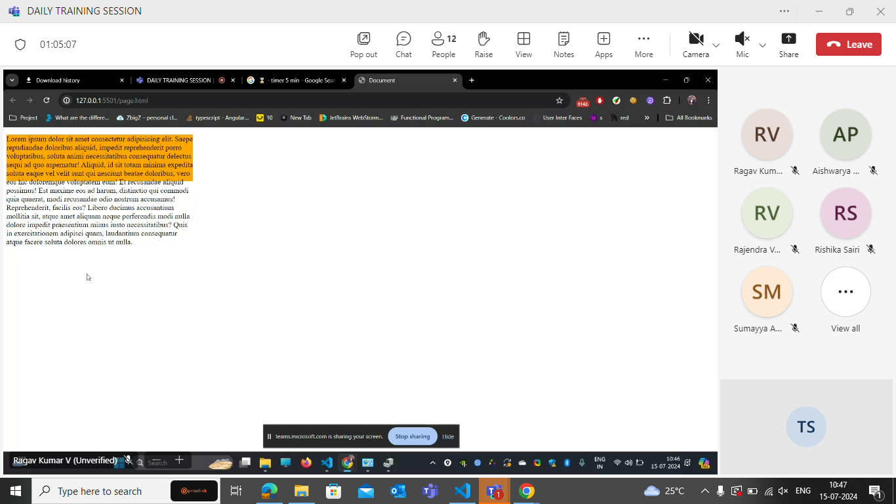
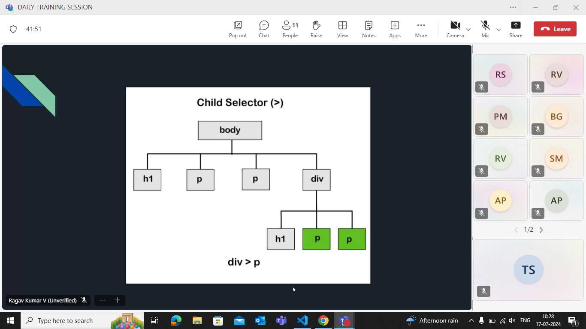
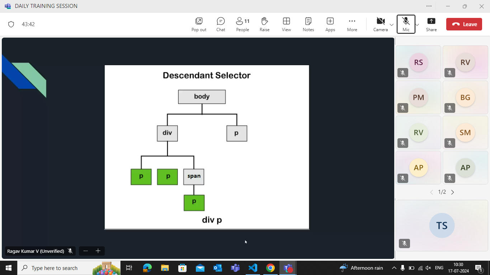
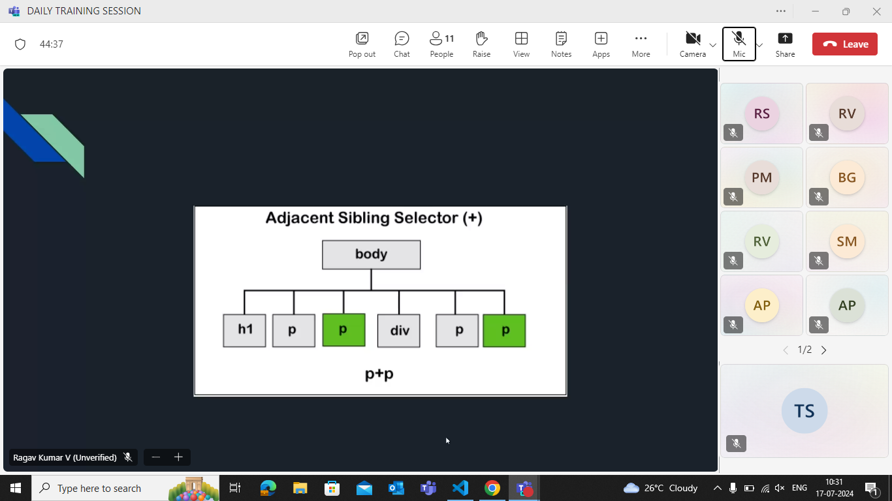
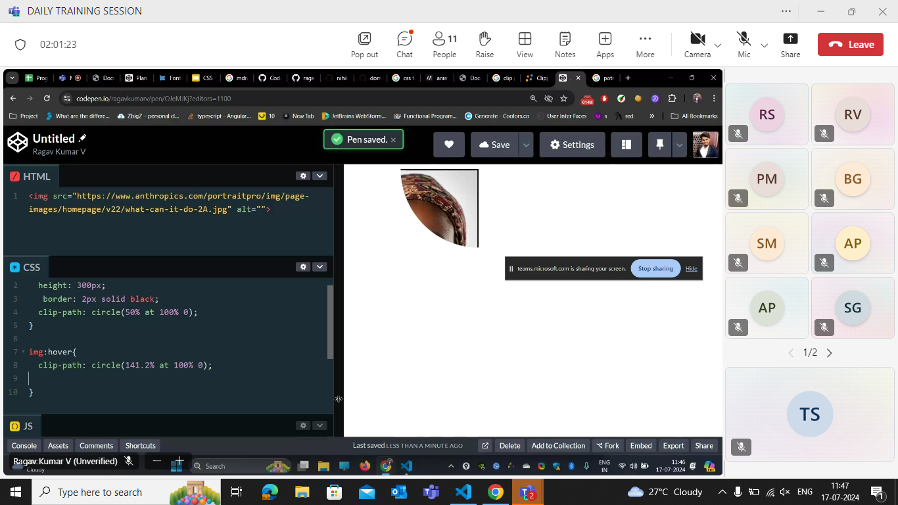
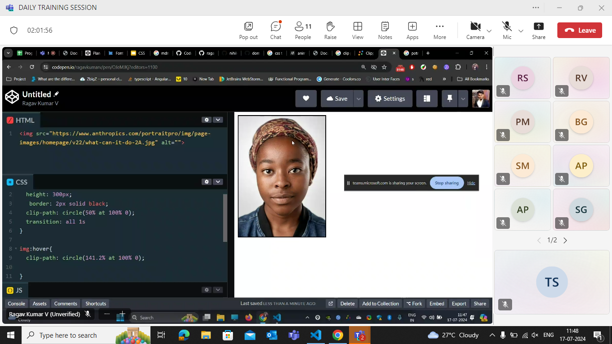
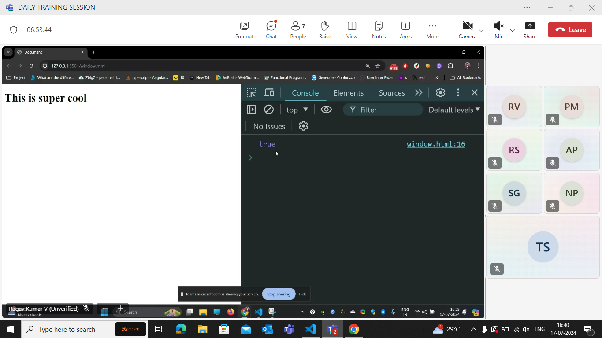
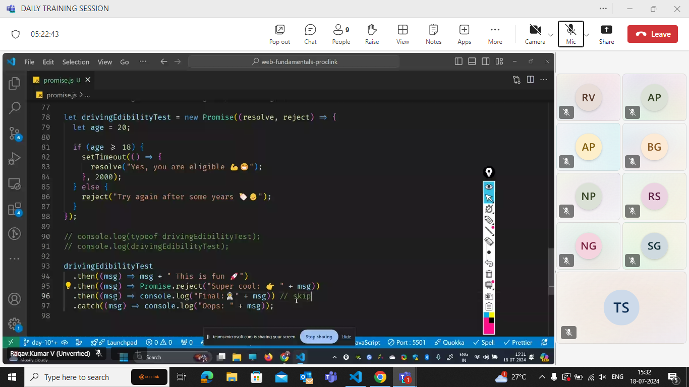

# JULY 15

i.e info is overflow.

overflow:auto;

- The inline block is a hybrid property.

> > The block level elements only respect about the hight and width.The inline elements doesnt care abt the height and width.
> > The block elements will not be able to give side-by-side.
> > The inline elements will be giving in the same line i.e side by side.

The solution for the above problem with <big>inline - block.</big>

- elements respect height - width.
- side by side.

- inline elements do not respect height and width,can get side by side
- only block level elements respects height and width,stacked

## Overflow

- hidden
- auto
- visible
- scroll

## Inline Block

- we use inline-block to respect height and width and get side by side

## Flex

- applies only 1 level
- applied to parent,not child

---

- By default maximum all are block (display:block)
- span is inline,anchor tag
- images are inline-block

---

- for flex,width is just a suggestion
- flex tries its maximum to keep everything side by side in one row
- good at distributing the gap

## Flex:

> The flex should be only applied to parent and it is only applicable for one -level.

- In flex it tries to match the height of highest ones.
- In genral if we squees the display the info will go to the next line,but in flex it will get squeesed.
  > In flex the width is just a suggestion.
- Flex mostly tries to put everything in side by side.
- good at distributing gaps

To mention something important in the priority we give !important.

---

## Background

- background:url(link),color
- if no content-use background height
- if we expand the container size,the background zooms in
- background-size:cover(zoom in ) or contain(zoom out)
- background-repeat:no-repeat(avoids multiple backgounds if the image is small)
- background-position:bottom-right
- to mix 2 colors,backgound-blend-mode: ,(adding a filter as in instagram)
- use the below 2 to get text in the centre of image
- align items:center
- justify content:center
- to rotate=>transform:rotate(10deg)

---

## SEMANTIC ELEMENTS

### header,footer,main and section are semantic elements

### div is not a semantic element

1.readability
2.ranking-(when google crawlers are )
-helps (visual..) people-better accessibility

## article and section

- multiple articles into one-we use section
  has context menu

## specificity : clash of style

Whenever there is a class of styles,which will get the higher priority
! important > inline > id > class > element>inheritance style.(overridding is happening).

- The lower priority is given to the inherited elements.

## Flex vs grid:

Flex understands 1D where as Grid understands 2D

- The flex doesnt bother about the alignment of the bordes.
  -The grid does understands the alignment and where to start the content.

# How to make a website responsive?

- To make a website responsive we use moblie first approch coz the mobile approach is better in laptop too but the desktop mode is not good in mobile.

# 17-07-24

- The whole process behind the filter application is maqtrix multiplication.

- The whole images are stored in terms of pixels

- As the size of the image increases weight of the array also increases.

## SVG

mat formula,light in size, cant break into images.

THe problem with svg is it doesnt support gradient(i.e shade of colors).

## CSS - Combinators

If we dont have child selector then we need to create multiple classes .

Selecting all the sibilings of the h1.

clip path

## Position

The position of the cookies are fixed..it is done by position

setattribut
removeattribute
getattribute-> it gets the value of the attribute.

in windows.confirm if we click ok then returns true if we click cancel then returns false.

promise.reject is an reject that might be occured from database.
so it will go to catch block.
