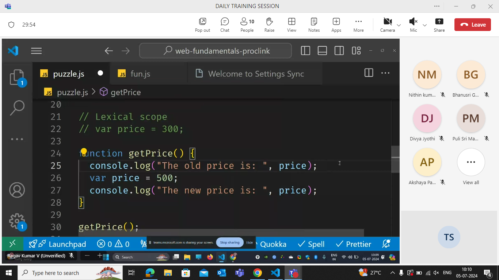
Local declaration has more priority then the outside variable.

The outer declaration doesnt have more priority.i.e the declaration.If we dont have any declarations inside then we will be looking into the outside variables.

### shadowing

```js
let x = 10;

function foo() {
  let x = 20;
  console.log(x);
}

foo();
console.log(x);
```

If a same variable name is declared inside and outside the function then the outside declaration is shadowed by the inside declared within the function.

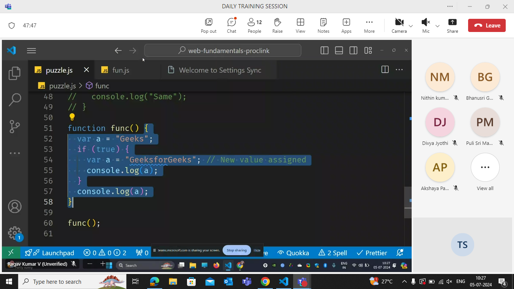
answer is :

gfg
gfg

### Function

The function which obeys all these are called higher order function.

If a function is treated as value then it is called first class citizen

1.function treated as value or argument
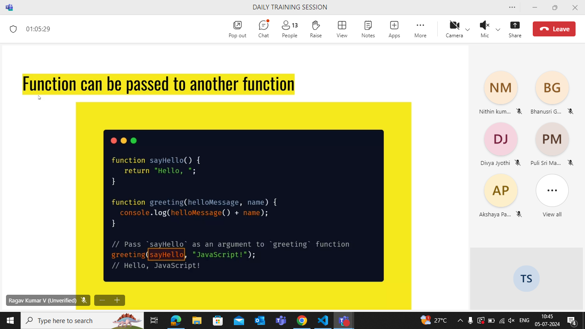
2.function returning anotherfunction

3.Assign function to a variable

```js
function sayhello() {
  return function () //anonymous function
  {
    console.log("Hello");
  };
}
var e = sayhello();
e(); //hello
```

If function can be treated as value then that can be a first class citizen. The above are the rules to be a first class citizen.

## Lexical Scope

outside part of their scope is lexical scope.
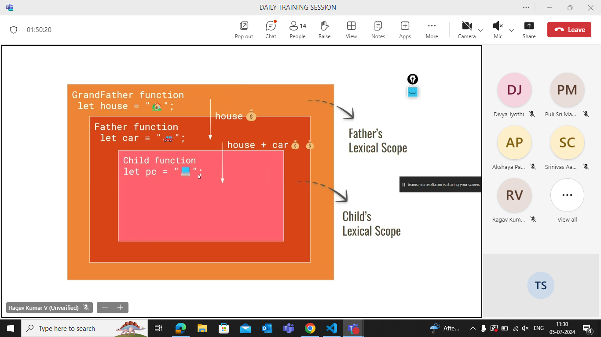

.png>)

## Closure

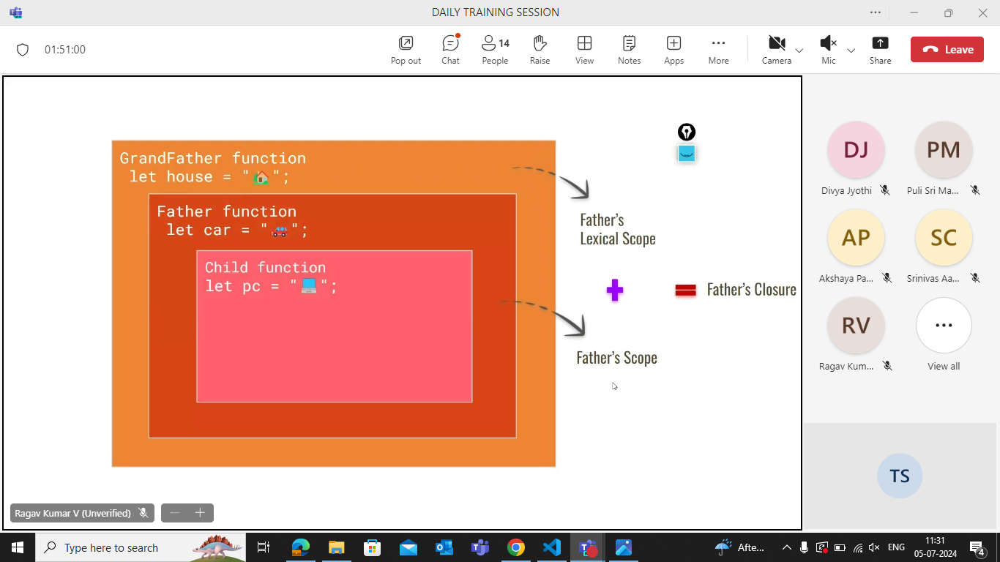

### Example Task


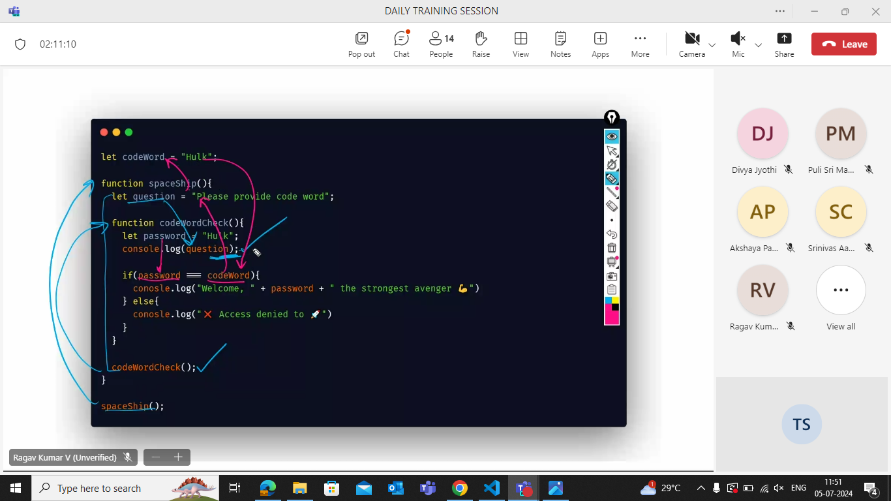

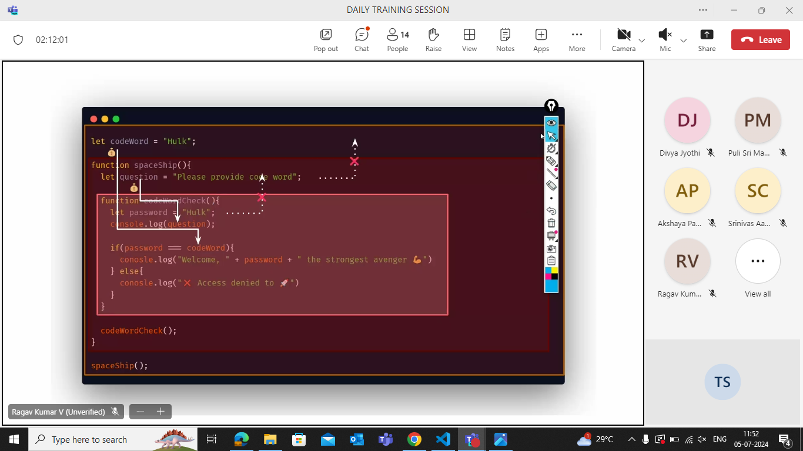

## Debugging


## Map (Array method)

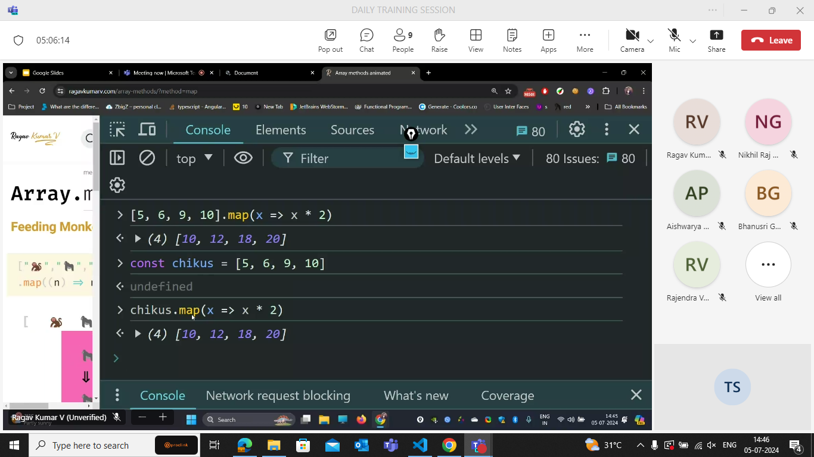

the behind logic

```js
c = [5, 6, 7, 8, 9];
function master(c) {
  let doubch = [];
  for (let m of c) {
    doubch.push(m * 2);
  }
  return doubch;
}
console.log(master(c));
```

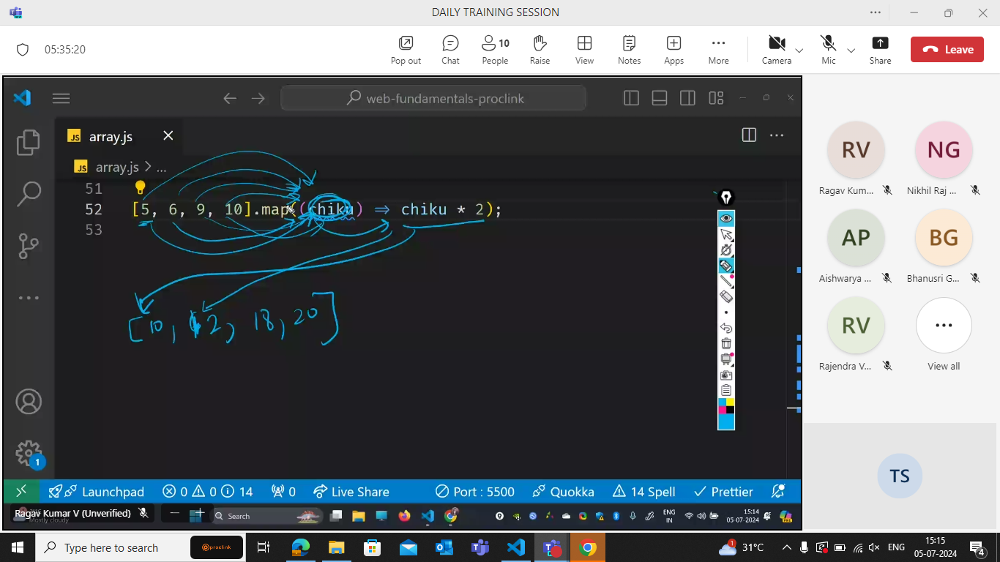
above is for easy understanding


actual explanation

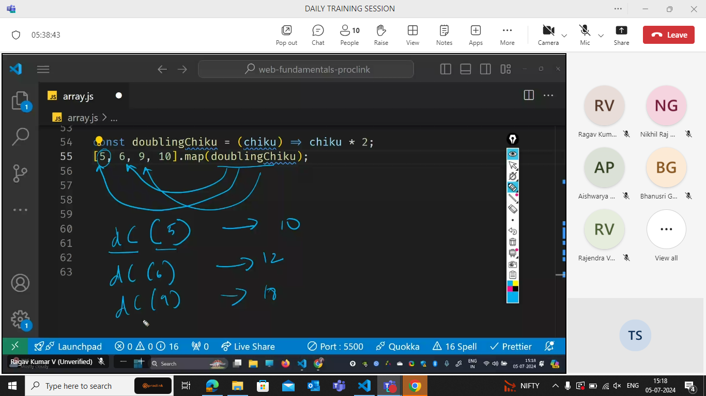

### imp of map:

1. returns a copy of the array i.e immutable
2. the array length of input array size and output is same
3. It transforms datatypes.

### imp of filter:

the function which returns true is stored in the variable.

1. returns a copy of the array i.e immutable
2. the array length of input array size is greater than or equal to output size.
3. input datatype === output datatype

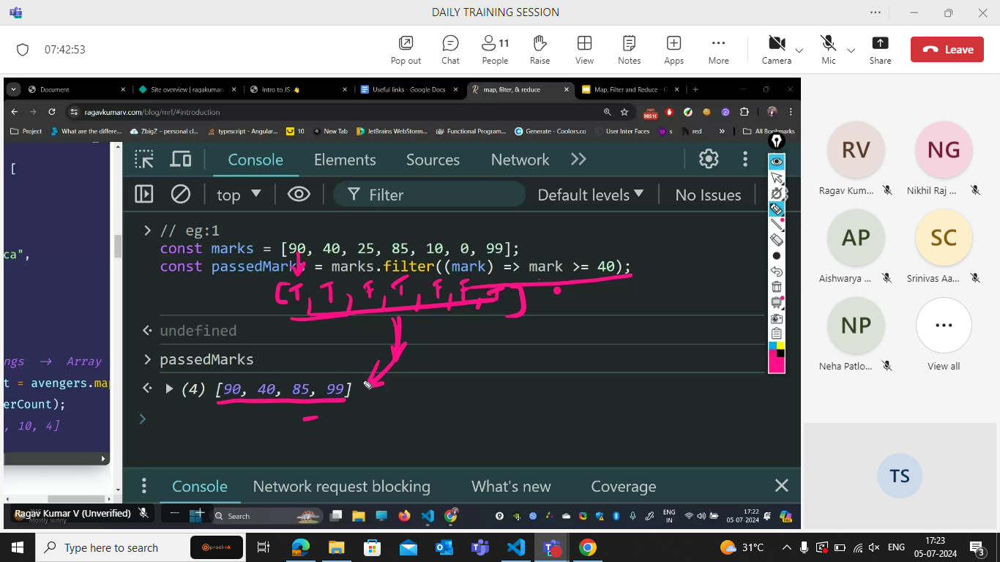

## Task


ES6 FEATURES:

> LET&CONST  
>  TEMPLATE LITERAL (back tick)  
>  SPREAD OPERATOR  
>  REST OPERATOR  
>  DESTRUCTIONG  
>  CLASS' ARROW FUNCTION==>  
>  PROMISE  
>  NUMERIC SPEARATORS 1_00_00_00  
>  nullish

- function goes to argument. in map

- tosorted will return the copy (this is an immutable type)

.png>)
it will change the algorithm based on the size.

nums.sort((a, b) => a - b ) --- > this will give ascending.

- to get descending use b-a

# array method--every

.png>)
every person is human, alien is there, thats why its false.  
 this ressembles and operator.

# array method--some

.png>)
this ressembles "or" operator.

# array method--includes

.png>)
it will check if particular item is present or not

it is similar to some.

## Destructuring

url(https://resources.ragavkumarv.com/slides-javascript-day-2--es6/14)

.png>)

.png>)
this is defensive code.

there is a better way to write, just to get city and without error out.
we can use optional chaining

we normally person1.place.city is used then error comes
person1?.place?.city
--it doesnot give error,it gives undefined.

```js
const person1 = {
  name: {
    first: "Alice",
    last: "Johnson",
  },
  age: 28,
  favoriteColors: ["blue", "green"],
  place: {
    //     city: "Chennai",
  },
};

if (person1.place) {
  if (person1.place.city) {
    console.log("city is not known");
  } else {
    console.log(person1.place.city);
  }
} else {
  console.log("city is unknown");
}

//or

person1?.place?.city;
// ?.--optional chaining
person1?.place?.city || "unknown";
//if person1?.place?.city is falsy, then unknown is given as output

// null,undefined as taken as falsy in nullish colleasc,
//or use
```

- if key name and variable name are same then it can be shortend--object shortend

- brackets is required to say its one object.

# reduce

can go from array to any datatype.

reduce(takes function as argument)

```js
.reduce((acc,curr)=>acc+curr,0)
```

2nd argument is initial value of accumulater.

> final value will be the accumulator value.

what map did, reduce can also do.

```js
const sum=[1,7,3,10,5].reduce((acc,curr)=> acc.concat(curr\*2),[])
```

```js
const sum = [1, 7, 3, 10, 5].reduce((acc, curr) => acc.concat(curr2), []);
```

## Mutable methods

push : Adds one or more elements to the end of an array.

```js
const fruits = ["Apple", "Banana", "Cherry"];
const newLength = fruits.push("Date", "Elderberry");
console.log(newLength); // Output: 5
console.log(fruits); // Output: ['Apple', 'Banana', 'Cherry', 'Date', 'Elderberry']
```

pop : Removes the last element from an array.

> If the array is empty when pop() is called, it returns undefined.

```js

```

shift: Removes the first element from an array.

unshift : Adds one or more elements to the beginning of an array.

sort : Sorts the elements of an array in place and returns the sorted array.

reverse : Reverses the order of the elements of an array in place.

## Immutable methods:

concat(): Returns a new array combining the array on which it is called with other arrays and/or values.

> a3=a1.concat(a2)

filter() :Returns a new array containing elements that pass a test specified

map() : Returns a new array with the results of calling a provided function on every element in the calling array.

slice() : Returns a shallow copy of a portion of an array into a new array object.

every() : Tests whether all elements in the array pass the test implemented by the provided function

```js
const numbers = [1, 2, 3, 4, 5];
const allGreaterThanZero = numbers.every((num) => num > 0);
console.log(allGreaterThanZero); // Output: true
```

some() :Tests whether at least one element in the array passes the test implemented by the provided function.

```js
const numbers = [1, 2, 3, 4, 5];
const someGreaterThanThree = numbers.some((num) => num > 3);
console.log(someGreaterThanThree); // Output: true
```

List of array methods :

           immutable     mutable (modify the orginal array)   return type

concat ✅ ❌ array

slice ✅ ❌ array

filter ✅ ❌ array

map ✅ ❌ array

reduce ✅ ❌

forEach ✅ ❌

every ✅ ❌ boolean

some ✅ ❌ boolean

push ❌ ✅ number(it returns the length of array)

pop ❌ ✅ any(the element removed from the end of the array)

shift ❌ ✅ any(the element removed from the begining of the array)

unshift ❌ ✅ number(it returns the length of array)

splice ❌ ✅ Array(an array containing the elements removed from the original array)

sort ❌ ✅ array

reverse ❌ ✅ array

## The valid js object


> To convert a js object into a JSON format we use a syntax:

```js
JSON.stringify(object name)
```


<b>Type of JSON Is "String"</b>

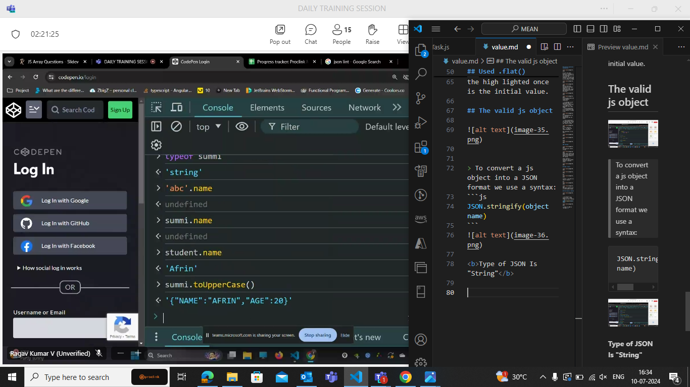

> > WE cannot have functions in our JSON.
> > In JSON we cannot use the .name Or such operations.

To convert the JSON Format into Js object .we use a method called PARSE.

```js
JSON.parse(json format name)
```


- serialization - JS to JSON

- deserialization - JSON to JS

The names are introduced to represent them in different formats.

## Shallow Copy


The shallow copy will make only one level of copy.

## Deep Copy


- The syntax for deep copy :

```js
var z = JSOn.parse(JSON.stringify(x));
```

If we have nested arrays we will have copy by reference(values are changed) in it to avoid those we use Deep copy(copy by value).

- whenever key and value name r same then we use object short hand.
- whenever function and function name r same then we use method short hand.

## Object : key value

- syntaxes to get keys,values,Both(Entities)


To findthe names of each operator

url(https://www.joshwcomeau.com/operator-lookup/)

# Imperative and declarative coding

imperative coding - tells how to do

declarative coding - tells what to do

- In general our code should be more declarative than imperative.

- functional programming encourages declarative coding.

paradigm - the flow of the work.
Different type of paradigm is :

- functional
- object oriented
- mathematical

## Assessment

def,example,how used in real world.

## what is Currying?

Currying in JavaScript is a functional programming technique where <big>a function with multiple arguments is transformed into a sequence of nested functions, each taking a single argument.</big>

- The result is a chain of functions.

- each of which function returns another function until all arguments have been supplied and the original function is ultimately executed.
- The importance of currying is for partial application and point free coding.

```js
// Regular function with multiple arguments
function multiply(a, b, c) {
  return a * b * c;
}

// Curried version of the multiply function
function curryMultiply(a) {
  return function (b) {
    return function (c) {
      return a * b * c;
    };
  };
}

const currymultiple = (a) => (b) => (c = a * b * c);

//imp part of currying we r returning a function inside a functioned.
// Using the curried function
console.log(curryMultiply(2)(3)(4)); // Output: 24

// Or using it step by step
const step1 = curryMultiply(2); // step1 is a function that expects 'b'
const step2 = step1(3); // step2 is a function that expects 'c'
const result = step2(4); // result will be 24

console.log(result); // Output: 24
```

```js
// Non-curried function
function greet(greeting, name) {
  return `${greeting}, ${name}!`;
}

// Curried version of the greet function
const curriedGreet = (greeting) => (name) => `${greeting}, ${name}!`;

// Using the curried function
const greetHello = curriedGreet("Hello");
console.log(greetHello("John")); // Output: "Hello, John!"

const greetGoodMorning = curriedGreet("Good morning");
console.log(greetGoodMorning("Alice")); // Output: "Good morning, Alice!"
```

## What is partial application

Partial application is a way to create a new function by fixing some of the arguments of an existing function.

- it allows you to fix a certain number of arguments to a function, creating a new function with fewer parameters.

```js
function add(a, b) {
  return a + b;
}

function addPartial(a) {
  return function (b) {
    return a + b;
  };
}

// Usage:
const add5 = addPartial(5);
console.log(add5(3)); // Output: 8
console.log(add5(10)); //Output : 15
```

## What is point free coding

function definitions do not include named parameters. Instead, functions are defined in terms of other functions, usually using function composition and higher-order functions

- combining simpler functions to create more complex functions without explicitly referencing the arguments of the functions involved

```js
// Non-point-free style
const numbers = [1, 2, 3, 4, 5];
const squaredEvens = numbers
  .filter((num) => num % 2 === 0)
  .map((num) => num ** 2);

// Point-free style
const isEven = (num) => num % 2 === 0;
const square = (num) => num ** 2;
const squaredEvensPointFree = numbers.filter(isEven).map(square);

console.log(squaredEvensPointFree); // Output: [4, 16]
```

not calling and implementing explicitly everytime.

## This keyword

> 'This' doesnt make any sense without any context.

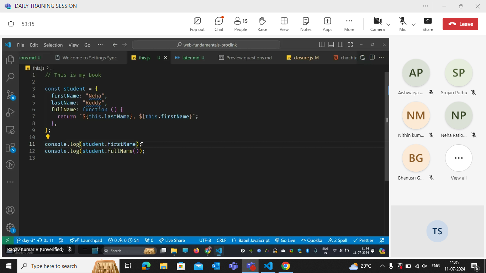

- The life of This is create where we r calling the function.

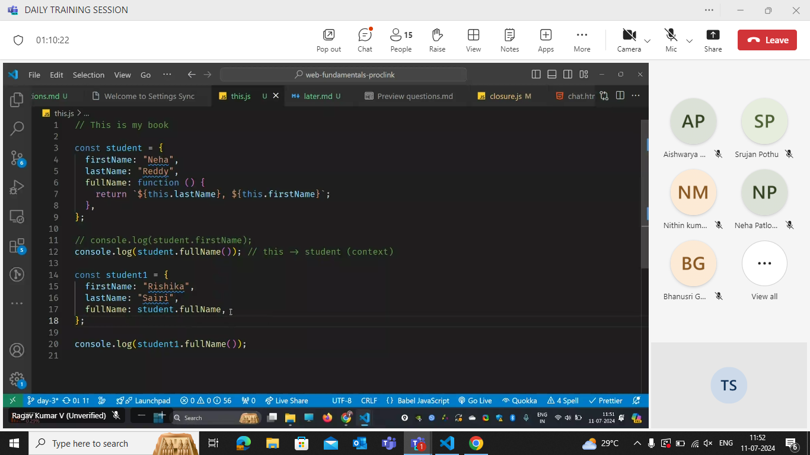

```js
const student = {
  firstname: "rishika",
  lastname: "sairi",
  fullname: function () {
    return `${this.lastname},${this.firstname}`;
  },
};

const student1 = {
  firstname: "neha",
  lastname: "reddy",
  fullname: student.fullname,
};
console.log(student1.fullname());

function fullname() {
  return `${this.lastname},${this.firstname}`;
}

console.log(fullname()); //undefined undefined
```

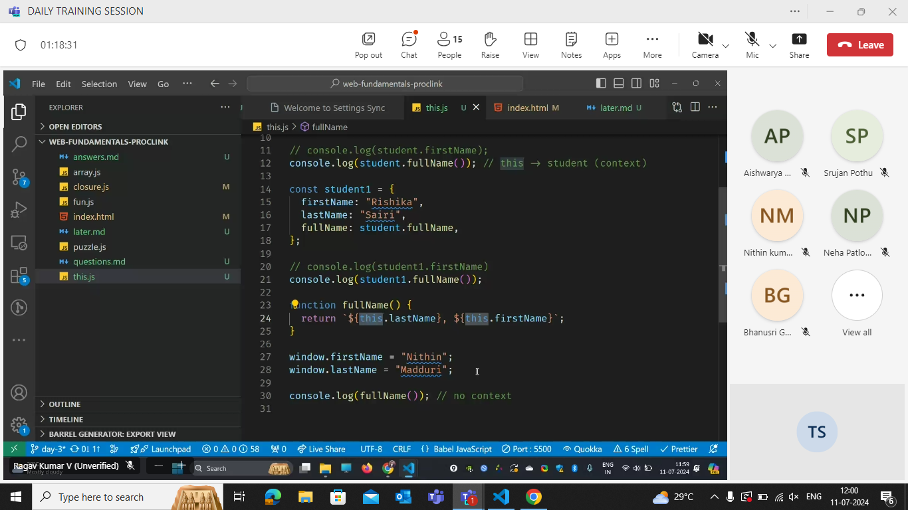
window is a global object i.e it follows the lexical scope.

> defaultly we a strict mode on if that mode is on we cant perform few operations like

```js
a = 4;
//This is not a valid syntax if we r in strict mode.

//If this declaration is not in strict mode then it will directly strict to the window.
```


(object short -hand)

### There are three ways to force the context to 'This'

1. call
2. apply
3. bind
   

- The call and apply are same when ever we pass only context but not the arguments.

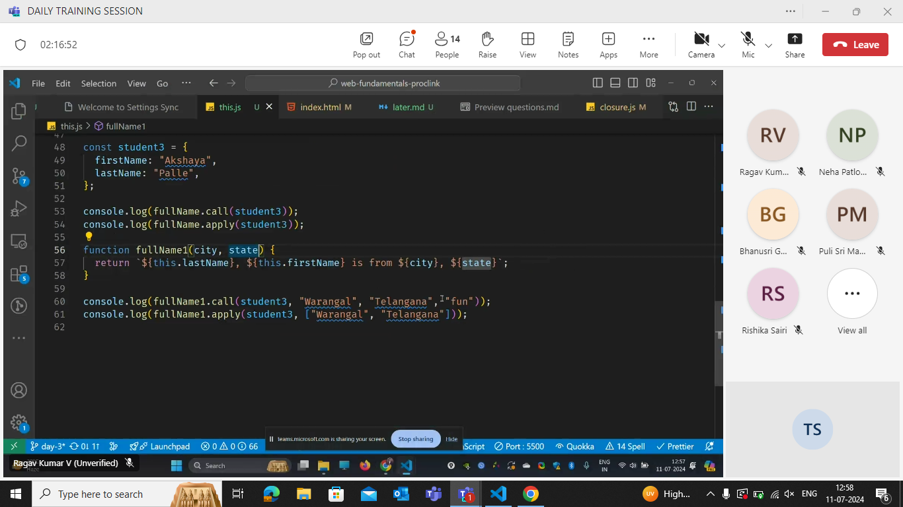

.png>)

- we are binding this with student3

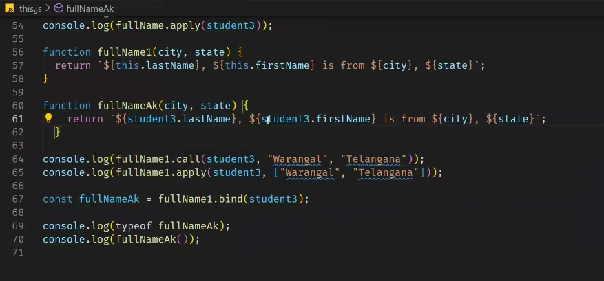
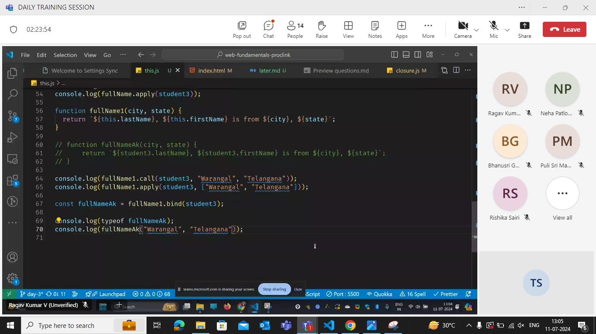

# Class

class - mimic a real world thing

.png>)

## 12-07-24

### Not recommended

=> =>

() ()

### Recommended

() =>

## Auto Boxing

converts a primitive type to Object.

example:

Number - class


