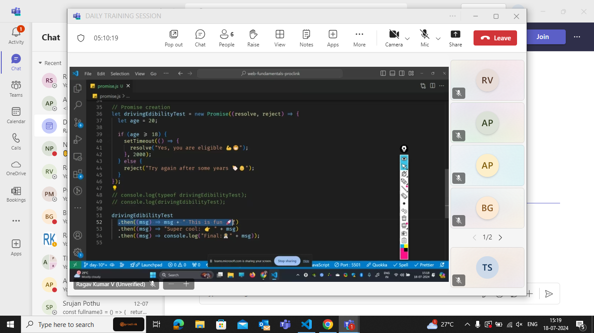

callback- action has to complete then only the reaction triggers
THe event hanlers are not the part of JS code.

The browser is divided into 4 parts:

The JS codes only run on call stack
the Webapis knows only to wait for timeout : here set timeout lives in
call back queue
Event loop :pushes that from callback queue to call stack if call stack is empty.

Whichever comes to webapis are asynchronous.

The call stack is called as blocking code i.e it blocks the code in callback queue.

when we wrote a for loop with 10000 lines then it will block the space of callstack for more time .

- So to avoid this we need to write a quality code following with 5 rules .

stackoverflow

## Promises

## Multiple promises

promise all will wait till one gets rejects if not all promises to complete.

In the above reject case in all - if one promise fails then all the promises gets failed

but in the race condition if first condition is a reject condition then it error outs.

Gets other promises data if one is rejected.(always an array of objects)

## .finally()

This .finally executes anyway i.e used for code building and logging

## Rest API

The json() will convert into js objecta and return

Fetching of data from API's

## Async/Await

Whenever fetch called it runs the round trip...

res.json() --> itself is a asynchronous function

the promises are present in the priority queue in the queue. If a setTimeOut() and promise() are going to the queue at the same time then the promises have more priority.

Task

