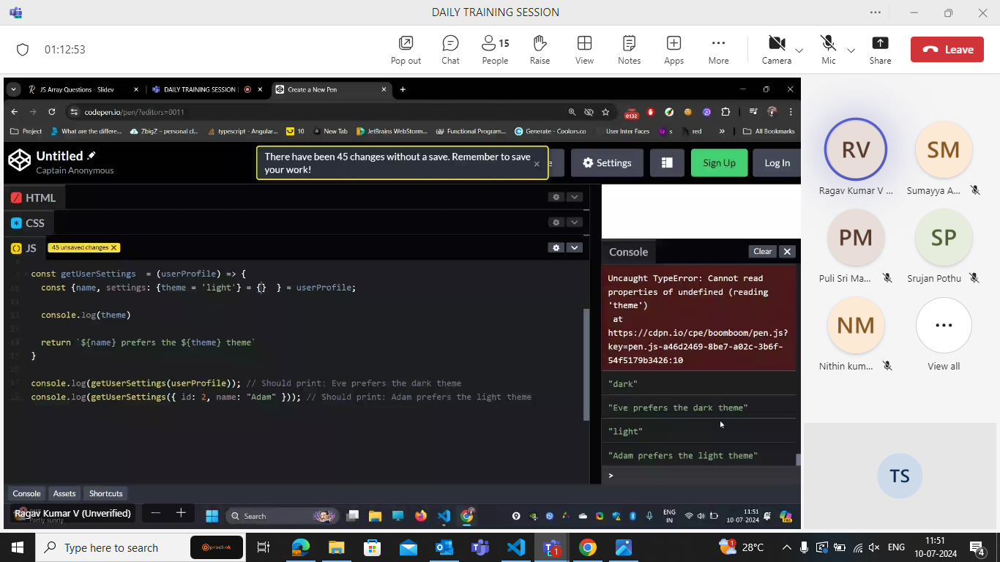
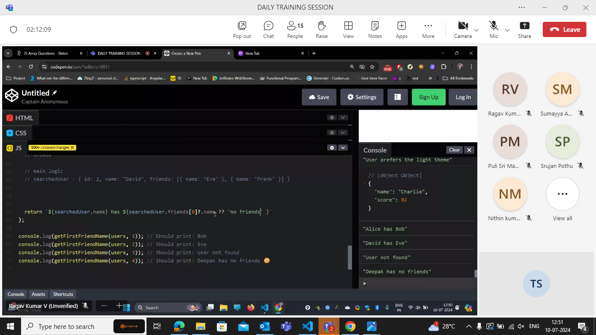

## practice questions explanation

we will not have access to settings in the above scenario coz it is already unpacked . we cant use it now .The only acces we can usenow is Theme.

here we declared settings as an empty object.for the conditions when theme and settings are not mentioned

in the above there are three default conditions

- if settings is not mentioned then it returns an empty aray
- if theme is not mentioned then light theme
- if the userprofile is not mentioned then it is default ti empty array.

in interpolations we can perform expressions but not stmts.

- y only expressions : coz expressions return a value but stmts can not return a value.

if is a stmt not exp .. it does not return anything

9th solutions in two ways :

11th

### ToFixed

to fixed will return string...

outer every checks the movies and inner every checks the ratings in the rating.

every returns a predicate that always returns a boolean value.

## Used .flat()

Q16

slice() - we used as a copy of movies .

Q17

the high lighted once is the initial value.

- The answer of every call is undefined.
- there is no context for the attack().
- gear second doesnt have a value in the actions context.

## 12-07-2024

addTransactions(parameters)//this is reducing the complexity

the arrangment of the code methods and variables should be as static,private,normal methods(public)
